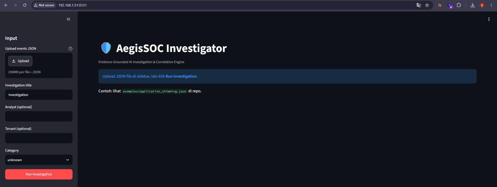
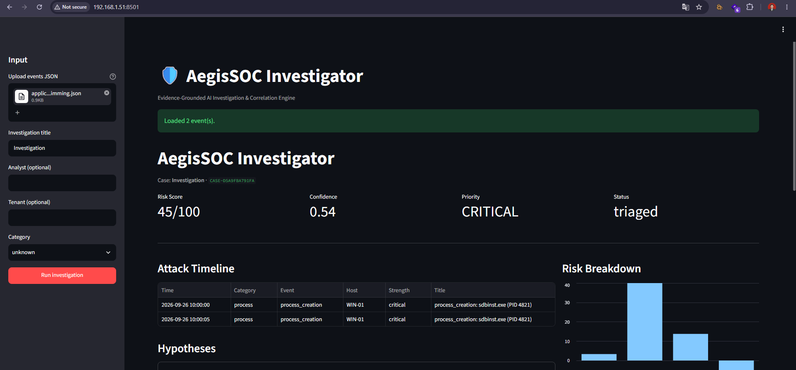

# AegisSOC

**Deterministic SOC Investigation Engine with Optional AI Enhancement**

AegisSOC transforms raw security events into structured, evidence-based investigation cases containing **evidence, correlations, hypotheses, risk scoring, and analyst-oriented narratives**.

The core philosophy is **deterministic-first**: the investigation engine does not depend on AI or external LLM services. AI is an optional enhancement layer that can assist with investigation narratives and analysis.

The system remains fully functional when AI providers are unavailable.



---

## What is AegisSOC?

AegisSOC is an investigation engine designed for SOC workflows.

It processes security events and produces structured investigation cases that can be **reviewed, reproduced, and audited**.

Every finding in the investigation is grounded in explicit evidence. The system does not generate findings without supporting evidence.

### Investigation Pipeline

```text
Raw Security Events
(Wazuh / Sysmon / File / NDJSON)
                |
                v
        Canonical Event Model
                |
        +-------+-------+
        |               |
        v               v
    Evidence      Entity & Relationship
   SHA-256 Hash        Graph
        |               |
        +-------+-------+
                |
                v
       Correlation Engine
                |
                v
        Hypothesis Engine
       MAIN / COUNTER / SUB
                |
                v
           Risk Engine
        Score: 0 - 100
        + Breakdown
                |
                v
        Investigation Case
                |
        +-------+--------+
        |                |
        v                v
Deterministic Report   Optional AI
   Always Available    Enhancement
```

AI sits **alongside the investigation pipeline**, not inside its core decision-making path.

The deterministic investigation pipeline remains the **source of truth** for evidence, correlations, hypotheses, and risk scoring.

---

## What AegisSOC is NOT

To clarify its scope:

* **Not an AI-first SOC** that relies on an LLM as its primary investigation engine.
* **Not a machine-learning detection system.** Detection is currently rule-based using Sigma-like rules and a LOLBin registry.
* **Not an autonomous response system.** AegisSOC investigates and analyzes security events but does not automatically execute response actions.
* **Not dependent on external AI services.** AI is optional; the deterministic investigation pipeline works without API keys or internet access.

---

## Architecture

AegisSOC is divided into two major layers:

1. **Deterministic Investigation Layer**
2. **Optional AI Enhancement Layer**

### Deterministic Investigation Layer

The deterministic layer is always available and does not require an LLM.

Given the same normalized input and configuration, the core investigation pipeline is designed to produce reproducible results.

| Component                 | Function                                                                  |
| ------------------------- | ------------------------------------------------------------------------- |
| Detection Engine          | Rule-based detection using Sigma-like rules and LOLBin registry           |
| Evidence Engine           | Converts events into traceable evidence with content hashing              |
| Graph Engine              | Extracts entities and builds relationships                                |
| Correlation Engine        | Correlates events using host, temporal, process, and relationship context |
| Hypothesis Engine         | Generates MAIN, COUNTER, and SUB hypotheses                               |
| Risk Engine               | Calculates risk score using explicit scoring factors                      |
| Reporter                  | Generates Markdown, JSON, and text reports                                |
| Deterministic Rule Engine | Generates rule-based investigation narratives                             |

All deterministic components are designed to be **reproducible and auditable**.

### Optional AI Enhancement Layer

AI providers are opt-in and operate as an enhancement layer on top of the deterministic investigation result.

| Component                | Type                  | Activation                    |
| ------------------------ | --------------------- | ----------------------------- |
| Ollama Provider          | Local LLM             | `--ai --provider ollama`      |
| Cloud LLM Provider       | OpenAI-compatible LLM | `--ai --provider cloud`       |
| Multi-Agent Orchestrator | Agent orchestration   | `--ai --provider multi_agent` |

The **Multi-Agent Orchestrator is not an LLM provider**. It is an orchestration pattern that coordinates investigation agents such as hypothesis, counter-analysis, critic, and reporting agents. Depending on the configuration, these agents can operate with or without an LLM underneath.

---

## Graceful Degradation

AI failures are isolated from the deterministic investigation pipeline.

The core investigation does not depend on AI availability.

Typical behavior:

```text
AI Requested?
     |
     +-- No --> Deterministic Investigation
     |
     +-- Yes
           |
           v
     Provider Available?
           |
       +---+---+
       |       |
      Yes      No
       |       |
       v       v
   AI Layer   Fallback
       |       |
       +---+---+
           |
           v
Deterministic Investigation Result
```

Depending on the configured provider:

* Missing API credentials can cause the affected provider to be skipped.
* An unavailable local LLM provider can trigger fallback behavior.
* AI provider failures do not invalidate the deterministic investigation result.
* If AI is unavailable, the deterministic rule engine remains available for narrative generation.

### Important Separation

The following investigation components do **not** require an LLM:

* Evidence extraction
* Entity extraction
* Relationship building
* Correlation
* Hypothesis generation
* Risk scoring
* Deterministic reporting

AI is therefore an **enhancement**, not a prerequisite for investigation.

---

## When AI is Used

AI is only invoked when it is explicitly requested and the selected provider is available.

For example:

```bash
--ai --provider ollama
```

or:

```bash
--ai --provider cloud
```

Without the `--ai` option, the investigation runs entirely through the deterministic pipeline.

This makes it possible to compare:

```text
Same Security Events
        |
   +----+----+
   |         |
   v         v
No AI      With AI
   |         |
   v         v
Deterministic  Deterministic
Investigation  Investigation
   |         +
   |       AI Enhancement
   |         |
   +----+----+
        |
        v
Investigation Case
```

The deterministic investigation remains the basis for the final case.

---

## Features

| Category            | Feature                   | AI Dependency             |
| ------------------- | ------------------------- | ------------------------- |
| Ingestion           | Wazuh alerts              | None                      |
| Ingestion           | Sysmon events             | None                      |
| Ingestion           | File / NDJSON events      | None                      |
| Detection           | Sigma-like rules          | None                      |
| Detection           | LOLBin registry           | None                      |
| Graph               | Entity extraction         | None                      |
| Graph               | Relationship builder      | None                      |
| Correlation         | Event pair correlation    | None                      |
| Correlation         | Event clustering          | None                      |
| Correlation         | Timeline analysis         | None                      |
| Evidence            | SHA-256 content hashing   | None                      |
| Evidence            | Evidence provenance       | None                      |
| Hypothesis          | MAIN hypothesis           | None                      |
| Hypothesis          | COUNTER hypothesis        | None                      |
| Hypothesis          | SUB hypothesis            | None                      |
| Risk                | Multi-factor risk scoring | None                      |
| Risk                | Risk breakdown            | None                      |
| Threat Intelligence | VirusTotal adapter        | Optional external service |
| Threat Intelligence | AlienVault OTX adapter    | Optional external service |
| Threat Intelligence | MISP adapter              | Optional external service |
| Narrative           | Deterministic rule engine | None                      |
| Narrative           | Multi-agent orchestration | Optional                  |
| Narrative           | Ollama LLM                | Optional                  |
| Narrative           | Cloud LLM                 | Optional                  |
| Feedback            | Analyst verdict tracking  | None                      |
| Simulation          | Built-in attack scenarios | None                      |
| Interface           | CLI                       | None                      |
| Interface           | Streamlit dashboard       | None                      |
| Interface           | REST API                  | None                      |
| Deployment          | Docker                    | None                      |
| Deployment          | Kubernetes                | None                      |
| Deployment          | Helm                      | None                      |
| Observability       | Application logging       | None                      |
| Observability       | Prometheus metrics        | None                      |
| Observability       | Tracing                   | None                      |

### Threat Intelligence

AegisSOC provides adapters for:

* VirusTotal
* AlienVault OTX
* MISP

Live threat-intelligence lookups depend on the corresponding external service configuration, credentials, and/or endpoints.

Threat intelligence is therefore an **external enrichment capability**, not a prerequisite for the core investigation pipeline.

---

## Quick Start

### Requirements

* Python 3.x
* Git
* Optional:

  * Ollama for local LLM inference
  * Cloud LLM API credentials
  * Docker
  * Kubernetes
  * Helm

### Installation

```bash
git clone https://github.com/rndy4ty/aegis-soc.git
cd aegis-soc

python -m venv .venv
source .venv/bin/activate

pip install -r requirements.txt
```

---

## Run Investigation Without AI

```bash
python -m cli investigate \
  --events examples/application_shimming.json \
  --title "Application Shimming" \
  --format markdown
```

No LLM is invoked.

The investigation is processed through the deterministic pipeline.

---

## Run Investigation With AI Enhancement

### Multi-Agent Orchestration

```bash
python -m cli investigate \
  --events examples/application_shimming.json \
  --title "Application Shimming" \
  --format markdown \
  --ai \
  --provider multi_agent
```

### Ollama

Start Ollama in a separate terminal:

```bash
ollama serve
```

Then run:

```bash
python -m cli investigate \
  --events examples/application_shimming.json \
  --title "Application Shimming" \
  --format markdown \
  --ai \
  --provider ollama
```

### Cloud LLM

Configure the required API credential:

```bash
export AEGIS_CLOUD_LLM_API_KEY="your-api-key"
```

Then run:

```bash
python -m cli investigate \
  --events examples/application_shimming.json \
  --title "Application Shimming" \
  --format markdown \
  --ai \
  --provider cloud
```

> Never commit API keys or other secrets to the repository.

---

## Attack Simulation

AegisSOC includes built-in attack scenarios for testing the investigation pipeline.

List available scenarios:

```bash
python -m cli scenario list
```

Run Application Shimming simulation:

```bash
python -m cli scenario run shimming --format text
```

Run PowerShell cradle simulation:

```bash
python -m cli scenario run powershell_cradle --format markdown
```

Run credential dumping simulation:

```bash
python -m cli scenario run credential_dump --format text
```

Run lateral movement simulation:

```bash
python -m cli scenario run lateral_movement --format json
```

These scenarios are intended for **controlled testing and demonstration of the investigation engine**.

---

## Docker

Build the Docker deployment:

```bash
cd deploy
docker compose build
```

Run an investigation:

```bash
docker compose run --rm aegis \
  investigate \
  --events /data/application_shimming.json \
  --title "Application Shimming" \
  --format text
```

---

## Dashboard

Install the dashboard dependencies:

```bash
pip install -r requirements-dashboard.txt
```

Start Streamlit:

```bash
streamlit run internal/dashboard/app.py
```

Then open:

```text
http://localhost:8501
```

The dashboard provides a visual interface for:

* Investigation input
* Case metadata
* Risk score
* Confidence
* Priority
* Investigation status
* Attack timeline
* Hypotheses
* Risk breakdown
* Investigation narrative
* Report export

---

## REST API

Install API dependencies:

```bash
pip install -r requirements-api.txt
```

Start the API:

```bash
uvicorn api.main:app --reload
```

The API will be available at:

```text
http://localhost:8000
```

Interactive Swagger documentation:

```text
http://localhost:8000/docs
```

---

## Example Investigation Output

### Deterministic Investigation

Example:

```text
Investigation: Application Shimming

Risk Score : 45/100
Confidence : 0.54
Priority   : CRITICAL
Status     : triaged

Risk Breakdown:
  evidence    +40.0
  correlation  +3.3
  hypothesis +13.8
  penalty     -12.0

Hypotheses:

[MAIN]
Possible persistence via Application Shimming
Status: supported
Confidence: 0.55

[COUNTER]
Legitimate Windows compatibility activity

[SUB]
Correlated event cluster indicates a single activity

Recommended Actions:

- Inspect sdbinst.exe command line and parent process.
- Review Shim Database modifications.
- Collect missing evidence related to the initiating parent process.
```

The exact output may vary depending on the input events, rules, configuration, and current implementation.

### AI-Enhanced Narrative

When AI is enabled, the deterministic investigation result can be supplemented with an AI-generated narrative.

Example:

```text
AI Narrative

The investigation analyzed 2 events from the related host.
The system identified 2 evidence items and 1 correlation between
the events.

[narrative generated by the configured AI provider]

Investigation Report: Application Shimming

[deterministic investigation report]
```

The AI narrative does not replace the underlying deterministic evidence, correlations, hypotheses, or risk calculation.

---

## Screenshots

### Dashboard — Initial View

Streamlit interface for starting an investigation and viewing case metadata.


### Dashboard — Investigation Result

Investigation result view containing metrics cards, attack timeline, hypotheses, and risk breakdown.



---

## Testing

Run the complete test suite:

```bash
pytest -q
```

The test count may change as the project evolves.

Current checkout status should be verified directly by running:

```bash
pytest -q
```

The test suite covers areas including:

* Domain and Pydantic models
* Detection engines
* Evidence processing
* Correlation engines
* Graph components
* Hypothesis generation
* Risk scoring
* AI providers
* Investigation pipeline
* REST API
* Simulation scenarios
* Dashboard-related components
* Integration workflows

The project is designed to keep the deterministic investigation path reproducible and testable.

---

## Project Structure

```text
aegis-soc/
├── pkg/
│   └── models/                  # Domain models and Pydantic schemas
│
├── internal/
│   ├── collector/               # Wazuh, Sysmon, and file collectors
│   ├── detection/               # Sigma-like rules and LOLBin registry
│   ├── correlation/             # Timeline, event correlation, process context
│   ├── graph/                   # Entity extraction and relationship building
│   ├── evidence/                # Event-to-evidence transformation
│   ├── investigation/           # Investigation orchestration, hypotheses, risk
│   ├── threat_intel/            # VirusTotal, OTX, and MISP adapters
│   ├── ai/                      # Rule engine, multi-agent, and LLM adapters
│   ├── feedback/                # Analyst verdict tracking
│   ├── simulation/              # Built-in attack scenarios
│   ├── observability/           # Logging, metrics, and tracing
│   ├── reporter/                # Markdown, JSON, and text reporters
│   └── dashboard/               # Streamlit dashboard
│
├── cli/                         # Command-line interface
├── api/                         # FastAPI REST API
├── deploy/                      # Docker, Kubernetes, and Helm
├── docs/                        # Documentation and screenshots
└── tests/                       # Unit, integration, and API tests
```

---

## Investigation Model

AegisSOC separates **facts, relationships, hypotheses, and risk assessment**.

```text
Security Event
      |
      v
   Evidence
      |
      v
Entity / Relationship
      |
      v
   Correlation
      |
      v
  Hypotheses
   /   |   \
MAIN COUNTER SUB
      |
      v
 Risk Assessment
      |
      v
Investigation Case
```

This separation allows the investigation result to remain traceable to its underlying evidence.

---

## Design Principles

### 1. Deterministic First

The core investigation pipeline is reproducible and independent of AI availability.

### 2. Evidence Grounded

Findings are based on explicit evidence rather than unsupported model-generated conclusions.

Evidence can include provenance and SHA-256 content hashes for traceability.

### 3. Auditable

Risk scores expose their contributing factors instead of relying on an opaque score.

### 4. AI Optional

The system remains functional without an LLM.

AI can enhance investigation narratives and analysis but is not required for the core investigation pipeline.

### 5. Graceful Degradation

AI provider failures are isolated from deterministic investigation processing.

The system can continue using deterministic functionality when AI services are unavailable.

### 6. Separation of Concerns

Detection, evidence, correlation, hypothesis generation, risk assessment, reporting, and AI enhancement are separated into distinct components.

### 7. Immutable by Convention

Investigation models are treated as immutable after creation to reduce unintended state changes during processing.

---

## Scope and Safety

AegisSOC is intended for:

* Security monitoring
* Security event investigation
* SOC analyst workflows
* Detection engineering experiments
* Security research
* Controlled attack simulation
* Investigation pipeline development

AegisSOC does **not** automatically execute containment, remediation, or other response actions.

The simulation features should be used only in systems and environments where the user has authorization to perform security testing.

---

## Documentation

Additional documentation:

* [Architecture](docs/architecture.md) — investigation pipeline and system layers
* [Data Model](docs/data_model.md) — domain model and schema reference
* [Demo](docs/demo.md) — walkthrough and example investigation
* [Design Decisions](docs/design.md) — design principles and engineering trade-offs

---

## Repository

GitHub repository:

https://github.com/rndy4dty/aegis-soc

---

## License

MIT
